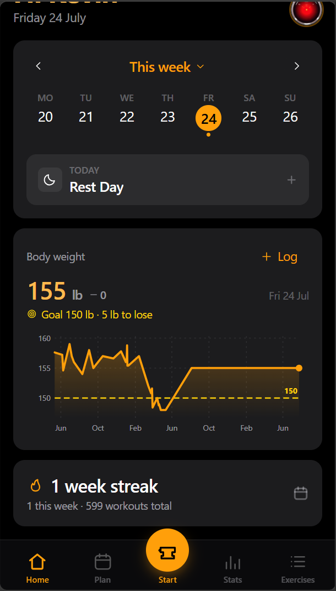
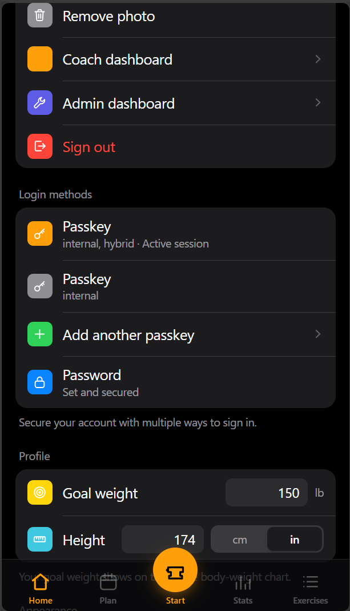
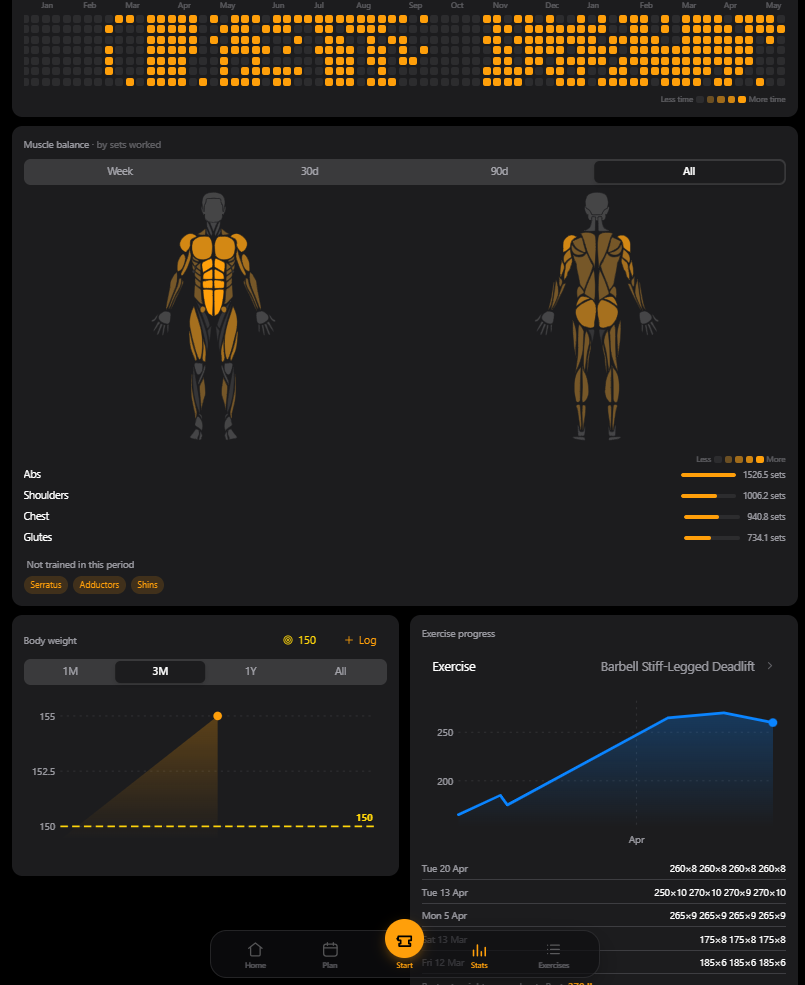
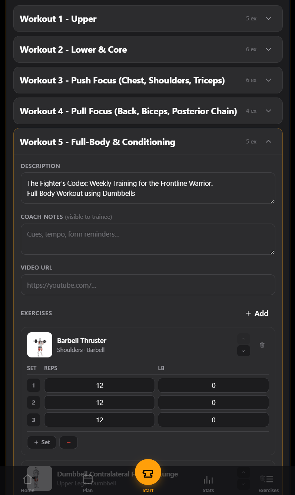
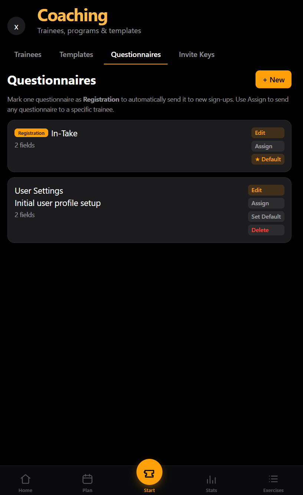

# Forge Fitness Server (FFS)

A minimal, self-hosted, open-source fitness tracking server with workout planning, exercise library, and progress analytics.







**FFS** is designed for:
- Personal fitness tracking and workout planning
- Self-hosted deployment
- Privacy-focused
- Passkey, Passwords or Either
- Offline-first operation (no external dependencies)
- Coach/Trainer support for managing multiple clients
- Progress tracking with charts and analytics
- Mobile and desktop friendly UI
- Open-sources

## Quick Start

```bash
git clone https://github.com/ForgeFitServer/ForgeFitServer.git
cd ForgeFitServer
```

### 2. Configure Environment

Update `.env` with your desired settings:

```env
cp .env.example .env

# Edit .env settings for your deployment
```

### 3. Start the Server

```bash
docker compose up -d
```

Open your browser to: **http://localhost:8080**

## Environment Variables

| Variable | Default | Purpose |
|----------|---------|---------|
| `WEB_PORT` | `8080` | External port for the web interface |
| `RP_ID` | `localhost` | Passkey RP ID (must match domain for production) |
| `ORIGIN` | `http://localhost:8080` | Full origin URL (must match deployment domain) |
| `RP_NAME` | `Forge Fitness Server` | Display name for passkey prompts |
| `BRAND_NAME` | `Forge Fitness Server` | Application branding name |
| `AUTH_MODE` | `all` | Login methods: `passkey`, `password`, or `all` (both). Users need only one. |
| `SESSION_SECRET` | `change-me-to-a-long-random-string` | Session encryption key |
| `INVITE_ONLY` | `false` | Restrict registration to invited users only |


## **Dont forget to create Backups**:

```bash
docker compose exec api tar -czf - /data | gzip > backup-$(date +%s).tar.gz
```

**Forge Fitness Server** — Train hard, track smart, stay free.

*Licensed under AGPL-3.0-or-later. See [LICENSE](LICENSE) for details.*